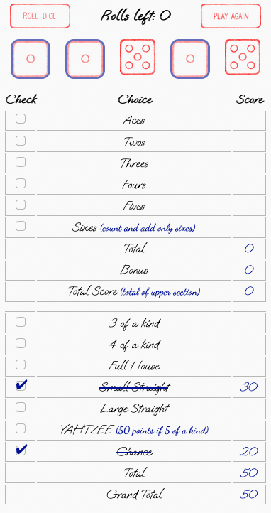

<p align="center">

</p>

<h1 align="center">Yahtzee</h1>


---

<p align="center"> Just a simple Yahtzee game made with Vanilla JavaScript.
    <br> 
</p>

## 📝 Table of Contents
- [About](#about)
- [Getting Started](#getting_started)
- [Usage](#usage)
- [Examples](#examples)
- [Screenshots](#screenshots)
- [Built Using](#built_using)
- [Author](#author)

## 🧐 About <a name = "about"></a>
This is automated version of Yahtzee game, which is being played for years now around the globe. The score and everything is added automatically so you won't have to worry about it. 

## 🏁 Getting Started <a name = "getting_started"></a>
Nothing is needed to run the code, it's fully web based, all you need is just go to the webpage and then it's ready to go - just click how to play, read the rules and you are good to go - hit the play button and have fun.

## 🎈 Usage <a name="usage"></a>
- Main screen has 2 options - play and how to play section, choose either one, depending on your need, by just clicking on the button.
- When in "play" section, dice will roll automatically on start, then either click on the "roll dice" or press "Enter" to reroll dice.
- Those dice which you want to leave unchanged can be "locked" by clicking on them, small border will appear so you know that they are locked.
- You have 3 rolls (2 rerolls), after that you need to click on one of the checkboxes to score the points, and roll dice.
- You don't need to lock the dice to score them, they will be scored automatically.
- If you want to be reminded on how things are scored - click on the name of the thing you want to score, it will show the scoring condition next to it, click again to hide it.
- If you want to play again, just press the play again button, game will uncheck everything, clear scores and roll dice.
- After all options are chosen, you will get a popup with a score, which you can close by clicking "OK", then you can see your scores.


## 🎲 Examples <a name = "examples"></a>
```
Your roll = 5, 5, 5, 3, 3
Choices:
Threes - 6 points (2x3),
Fives - 15 points (3x5),
3 of a kind - 21 points (3x5 + 3 + 3),
Full House - 25 points

Your roll = 6, 6, 6, 6, 6
Choices:
Sixes - 30 points (6x5),
3 of a kind - 30 points (3x6 + 6 + 6),
4 of a kind - 30 points (4x6 + 6),
Yahtzee = 50 points

Your roll = 5, 4, 2, 3, 1
Example choices:
Aces - 1 point (1 x 1), Twos - 2 points (1 x 2), etc.
Small Straight - 30 points, (using 1,2,3,4 or 2,3,4,5),
Large Straight - 40 points, (using 1-5)
Chance - 15 points (1+2+3+4+5)
```

## 📸 Screenshots <a name = "screenshots"></a>




## ⛏️ Built Using <a name = "built_using"></a>
HTML, CSS, SCSS, BEM, DOM, JavaScript

## ✍️ Author <a name = "authors"></a>
- [@DorBia](https://github.com/DorBia)
